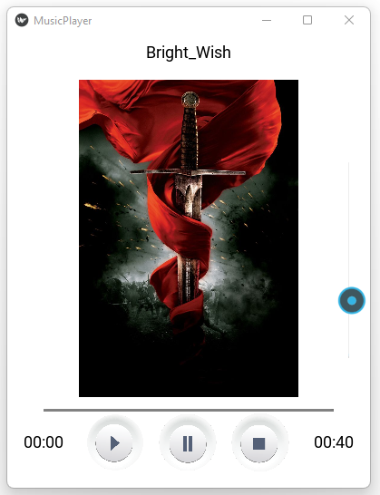

# Music Player App

This is a simple music player app that allows you to play music from your local storage. It is built using Python and the Tkinter library.

## Features

- Play/Pause music
- Display the current playing song
- Volume control slider
- Progress bar to show the current progress of the song
- Randomly select a song from the specified directory
- Display the total duration of the song
- Display the current time of the song
- Display album art of the song

## Requirements

- Python 3.x
- Kivy
- KivyMD

## Installation

1. Clone the repository
2. Install the required libraries using the following command:

```bash 
pip install -r requirements.txt
```

3. Run the app using the following command:

```bash
python Music_Player_app.py
```

## Usage

1. Place your music files in the `F:\music` directory
2. Run the app

## File Structure

- `Music_Player_app.py` - Main application file
- `assets/img`: Contains the album art images

## Screenshots




## License

This project is licensed under the MIT License - see the [LICENSE](LICENSE) file for details.